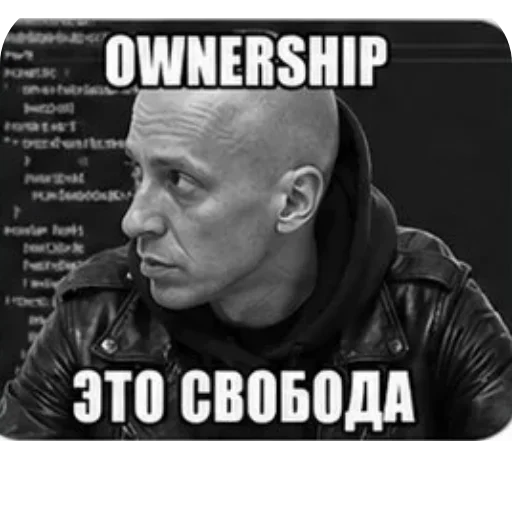
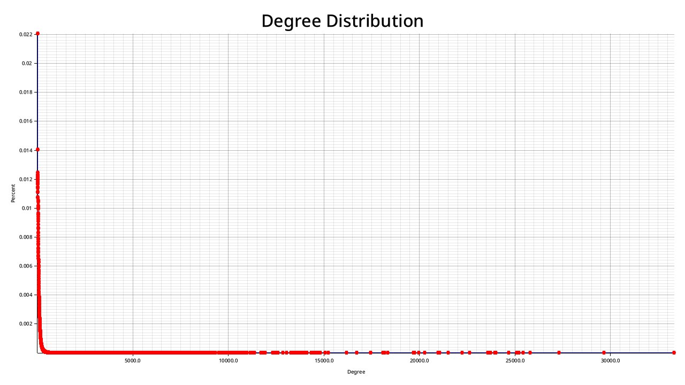
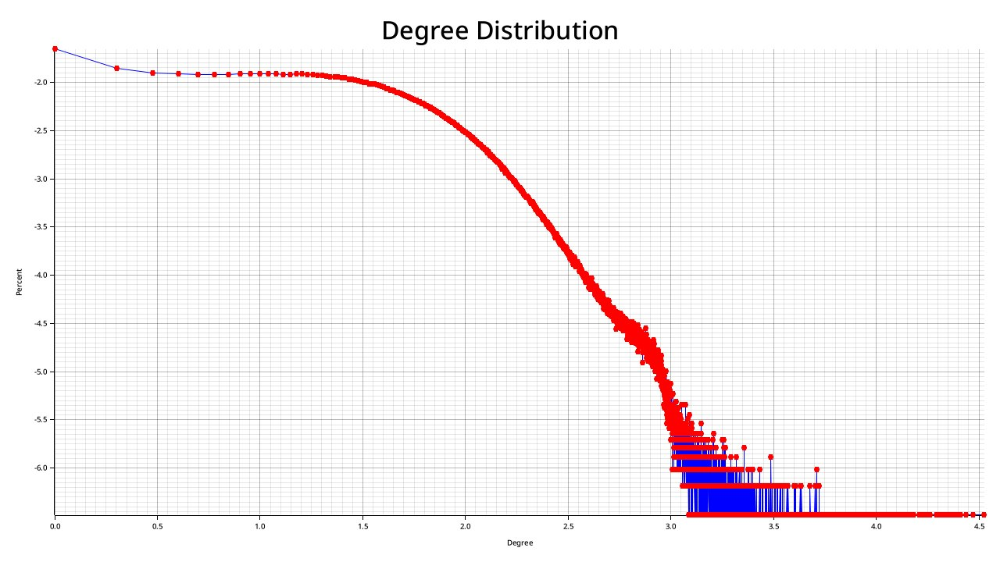

<!--
 ═══════════════════════════════════════════
   NetAnalisys — Презентация командного проекта
 Авторы: Мороз Владислав, Овечкин Андрей
 Группа 25Б72-мм, Команда №3, 2026
 ═══════════════════════════════════════════
-->

<!--
 ═══════════════════════════════════════════
  SLIDE 1 — Титульный
 ═══════════════════════════════════════════
-->
<!-- _class: title-slide -->

Командный проект

# NetAnalisys

Анализ структуры и приближённых расстояний в больших графах

Группа 25Б72-мм 
Команда №3 
СПбГУ 
2026

---

<!--
 ═══════════════════════════════════════════
  SLIDE 2 — Постановка задачи
 ═══════════════════════════════════════════
-->

Введение

<h1>Постановка задачи</h1>

**Проблема:** Графы социальных сетей содержат миллионы вершин и сотни миллионов рёбер. Точный расчёт кратчайших путей (APSP) непрактичен.

 

<h3>Три цели проекта</h3>

1. Разработать инструмент для **структурного анализа графов** — связность, кластеризация, устойчивость
2. Реализовать и сравнить **Landmark-алгоритмы оценки расстояний** (Basic LM, BFS LM) с 3 стратегиями выбора ориентиров
3. Провести эксперименты на **13 датасетах** — от 889 до ~3M вершин

 

<h3>Ключевые исследовательские вопросы</h3>

- Как устроена **топология реальных сетей**?
- Каков **trade-off между скоростью и точностью** landmark-алгоритмов?
- Какая **стратегия выбора ориентиров** оптимальна?

---

<!--
 ═══════════════════════════════════════════
  SLIDE 3 — Архитектура (разделитель)
 ═══════════════════════════════════════════
-->
<!-- _class: section -->

# Архитектура

---

<!--
 ═══════════════════════════════════════════
  SLIDE 4 — Архитектура NetAnalisys
 ═══════════════════════════════════════════
-->

Архитектура

<h1>Архитектура NetAnalisys</h1>

**Технологический стек:**
Rust (stable 1.88-1.95)
crossterm 
tokio
rayon
plotters
 

<h3>Модули</h3>

- **<code>graph/</code>** — списки смежности, маппинг ID, степени
- **<code>parser/</code>** — .txt / .csv / .mtx, автоопределение directed/undirected
- **<code>analysis/</code>** — 6 подмодулей: связность → степени → диаметр → треугольники → кластеризация → устойчивость
- **<code>landmarks/</code>** — Basic LM + BFS LM, 3 стратегии выбора

<h3>Интерфейс</h3>

- **<code>ui/</code>** — TUI-меню, файловый браузер
- **<code>interactive_landmarks/</code>** — запрос расстояний, accuracy- и speed-бенчмарки

 

<h3>Pipeline обработки</h3>

<pre>выбор датасета → парсинг → параллельный подсчёт метрик → вывод + PNG → интерактивный режим</pre>

---

<!--
  ═══════════════════════════════════════════
  SLIDE 5 — Стек
  ═══════════════════════════════════════════
-->

Архитектура

<h1 style="text-align:center;">Стек</h1>

Выбор очевиден

---

<!--
  ═══════════════════════════════════════════
  SLIDE 6 — Pipeline диаграмма
  ═══════════════════════════════════════════
-->

Архитектура

<h1 style="text-align:center;">Pipeline обработки</h1>

---

<!--
 ═══════════════════════════════════════════
  SLIDE 7 — Окружение (железо)
  ═══════════════════════════════════════════
-->

Тестирование

<h1>Окружение</h1>

 
 

<table style="font-size:18px; width:100%;">
<thead>
<tr><th style="width:30%; font-size:17px;">Компонент</th><th style="width:70%; font-size:17px;">Характеристика</th></tr>
</thead>
<tbody>
<tr><td><strong>Ноутбук</strong></td><td>ASUS Vivobook 16X</td></tr>
<tr><td><strong>CPU</strong></td><td>AMD Ryzen 7 7730U (8 ядер / 16 потоков, 2.0–4.5 GHz)</td></tr>
<tr><td><strong>GPU</strong></td><td>Radeon Vega 8 (integrated)</td></tr>
<tr><td><strong>RAM</strong></td><td>16 GB DDR4</td></tr>
<tr><td><strong>ОС</strong></td><td>Linux</td></tr>
<tr><td><strong>Язык / Бэкенд</strong></td><td>Rust (stable), tokio + rayon</td></tr>
</tbody>
</table>

Все тесты проводились на одном устройстве при стандартных условиях. Длительность замеров фиксировалась через ручное логирование в отдельынй файл <code>performance.log</code>.

<strong>Ключевые выводы по производительности:</strong> 
• Треугольники и Random 500 BFS — самые дорогие операции: до 120 с и <strong>20 мин</strong> на orkut 
• Double BFS на 3 порядка быстрее Random 500 BFS: 6 с vs 20 мин (<strong>×200</strong>) 
• На малых графах (&lt; 10K вершин) все pipeline-метрики считаются за доли секунды

---

<!--
  ═══════════════════════════════════════════
  SLIDE 8 — Время выполнения этапов
  ═══════════════════════════════════════════
-->

Тестирование

<h1>Производительность: время выполнения этапов</h1>

 

<table style="font-size:11px; width:100%;">
<thead>
<tr>
<th style="font-size:11px;">Этап</th>
<th style="font-size:11px;">Very Large (orkut) 3.07M V, 117M E</th>
<th style="font-size:11px;">Large 876K–3.2M V</th>
<th style="font-size:11px;">Medium 18K–326K V</th>
<th style="font-size:11px;">Small 889–7K V</th>
</tr>
</thead>
<tbody>
<tr><td><strong>Парсинг</strong> (parse_file)</td><td>81 s</td><td>4.8 s</td><td>70 ms</td><td>15 ms</td></tr>
<tr><td><strong>Слабая связность</strong> (WCC)</td><td>2.5 s</td><td>0.2 s</td><td>4 ms</td><td>0.3 ms</td></tr>
<tr><td><strong>Сильная связность</strong> (SCC)</td><td>—</td><td>0.7 s</td><td>1.6 ms</td><td>0.2 ms</td></tr>
<tr><td><strong>Степени</strong> (degree distribution)</td><td>14 ms</td><td>3 ms</td><td>0.1 ms</td><td>0.02 ms</td></tr>
<tr><td><strong>Треугольники</strong> (triangle count)</td><td>120 s</td><td>2.5 s</td><td>32 ms</td><td>6 ms</td></tr>
<tr><td><strong>Кластеризация</strong> (clustering coeff.)</td><td>9 ms</td><td>2 ms</td><td>0.2 ms</td><td>0.04 ms</td></tr>
<tr><td><strong>Double BFS</strong> (диаметр)</td><td>6.1 s</td><td>0.3 s</td><td>3 ms</td><td>80 µs</td></tr>
<tr><td><strong>P90 расстояний</strong> (percentile)</td><td>30 s</td><td>1 s</td><td>12 ms</td><td>0.3 ms</td></tr>
<tr><td><strong>Hub removal</strong> (robustness)</td><td>109 s</td><td>0.1 s</td><td>40 ms</td><td>80 ms</td></tr>
<tr><td><strong>Random removal</strong> (robustness)</td><td>140 s</td><td>0.15 s</td><td>60 ms</td><td>80 ms</td></tr>
<tr><td><strong>Random 500 BFS</strong> (отд. замер)</td><td><strong>~20 min</strong></td><td>5–10 s</td><td>0.5 s</td><td>35 ms</td></tr>
<tr style="background:#eef0fd;"><td><strong>Total runtime</strong></td><td><strong>~28 min</strong></td><td><strong>~5 s</strong></td><td><strong>~0.9 s</strong></td><td><strong>~0.4 s</strong></td></tr>
</tbody>
</table>

---

<!--
  ═══════════════════════════════════════════
  SLIDE 9 — Диаграмма: время обработки
  ═══════════════════════════════════════════
-->

Диаграммы

<h1 style="text-align:center;">Сводка времени обработки по категориям</h1>

---
<!--
 ═══════════════════════════════════════════
  SLIDE 10 — Orkut breakdown
 ═══════════════════════════════════════════
-->

Диаграммы

<h1 style="text-align:center;">Поэтапное время: Very Large граф (com-orkut)</h1>

---

<!--
 ═══════════════════════════════════════════
  SLIDE 11 — Датасеты
 ═══════════════════════════════════════════
-->

Данные

<h1>Датасеты</h1>

**13 графов, 3 категории** — широкий охват предметных областей

 

| Категория | Кол-во | Диапазон вершин | Диапазон рёбер | Примеры |
|-----------|--------|------------------|-----------------|---------|
| **Directed** | 5 | 7K – 876K | 2.9K – 5.1M | web-Google, web-Stanford, wiki-Vote, soc-wiki-Vote, web-NotreDame |
| **Undirected** | 5 | 889 – 1.7M | 29K – 15.2M | ca-coauthors-dblp, CA-GrQc, CA-AstroPh, musae-git-edges, ca-HepTh |
| **Large** | 3 | 1.1M – 3.07M | 3M – **117M** | com-youtube, com-orkut, vk |

 

От коллабораций учёных → веб-графы → социальные сети → мессенджеры.

---

<!--
 ═══════════════════════════════════════════
  SLIDE 12 — Результаты (разделитель)
 ═══════════════════════════════════════════
-->
<!-- _class: section -->

# Результаты анализа

---

<!--
 ═══════════════════════════════════════════
  SLIDE 13 — Pipeline анализа и вычисляемые метрики
 ═══════════════════════════════════════════
-->

Метрики

<h1>Pipeline анализа и вычисляемые метрики</h1>

<h3>Блок 1. Базовая статистика</h3>

- \|V\|, \|E\|, плотность
- Weak / Strong компоненты
- LWCC / LSCC

<h3>Блок 2. Степени</h3>

- min / max / avg degree
- Распределение степеней
- Regular + log-log шкалы

<h3>Блок 3. Диаметр</h3>

- Double BFS
- Random 500 BFS
- Snowball sampling
- 90-й перцентиль

<h3>Блок 4. Треугольники и кластеризация</h3>

- Полный подсчёт треугольников
- Средний коэффициент
- Глобальный коэффициент

<h3>Блок 5. Устойчивость</h3>

- Random removal (5%–100%)
- Degree-targeted removal
- Доля вершин в giant component

<h3>Визуализация</h3>

- PNG-графики распределений
- Терминальные графики
- Интерактивные запросы

---

<!--
 ═══════════════════════════════════════════
  SLIDE 14 — Распределение степеней
 ═══════════════════════════════════════════
-->

Метрики

<h1 style="text-align:center;">Распределение степеней</h1>

---

<!--
 ═══════════════════════════════════════════
  SLIDE 15 — Результаты: базовая статистика
 ═══════════════════════════════════════════
-->

Результаты

<h1>Базовая статистика графов</h1>

Все графы крайне разрежены: density ~10⁻⁵…10⁻³

 

| Параметр | Undirected (mean ± σ) | Directed (mean ± σ) | Large/youtube | Large/orkut |
|----------|------------------------|----------------------|---------------|-------------|
| **Density** | 0.00067 ± 0.00050 | 0.00151 ± 0.00171 | 0.000005 | **0.000025** |
| **LWCC** | 0.937 ± 0.098 | 0.975 ± 0.046 | 1.000 | 1.000 |
| **LSCC** | — | 0.221 ± 0.224 | — | — |
| **Avg Degree** | 24.59 ± 22.17 | 15.28 ± 10.15 | 5.27 | **76.28** |
| **Diameter (DBFS)** | 16.25 ± 5.12 | 12.0 ± 21.4 | **24** | **10** |

 

> **Ключевой инсайт:** у directed-графов слабая связность высока (<strong>LWCC ~0.97</strong>), но сильная — крайне низкая (<strong>LSCC ~0.22</strong>). Разрыв LWCC − LSCC ≈ <strong>0.75</strong>.

**Outlier:** soc-wiki-Vote — LSCC ≈ **0.001** (сильная компонента практически отсутствует).

---

<!--
 ═══════════════════════════════════════════
  SLIDE 16 — Результаты: кластеризация и треугольники
 ═══════════════════════════════════════════
-->

Результаты

<h1>Кластеризация и треугольники</h1>

Диапазон clustering coefficient — от **0.08** до **0.80**.

 

| Граф | Треугольники | Avg CC | Global CC | Тип |
|------|-------------|--------|-----------|-----|
| **ca-coauthors-dblp** | Гигантское | 0.80 | 0.08 (при 1.7M вершин) | Плотная сообществная структура |
| **com-orkut** | **627M** | **0.1666** | 0.041 (при 3M вершин) | Плотный, хабово-кластеризованный |
| **Wiki-vote / soc-wiki-Vote** | Умеренное | 0.15–0.25 | Низкий | Локальные кластеры без глобального замыкания |
| **web-NotreDame / youtube** | Низкое | Низкий | Низкий | Разреженная backbone-структура |

 

<strong>Clustering — маркер типа сети:</strong> высокий → community-heavy, низкий → hub-dominated.

---

<!--
 ═══════════════════════════════════════════
  SLIDE 17 — Результаты: устойчивость к удалению вершин
 ═══════════════════════════════════════════
-->

Результаты

<h1>Устойчивость к удалению вершин</h1>

Два сценария: **random removal** vs **degree-targeted removal**

 

| Граф | Random (50% удалено) | Targeted (50% удалено) | Характер |
|------|---------------------|------------------------|----------|
| **ca-coauthors** | Giant comp. сохранена | Медленная деградация, затем резкий обвал | Умеренная hub-зависимость |
| **musae-git-edges** | Giant comp. сохранена | Быстрый распад | Выраженная hub-архитектура |
| **web-Stanford** | Giant comp. сохранена | Резкий пороговый распад | Сильная hub-архитектура |
| **web-NotreDame** | Giant comp. сохранена | Экстремально быстрый коллапс | Экстремальный hub-dominance |

 

<strong>Вывод:</strong> все графы — hub-driven / scale-free. Случайное удаление разрушает медленно, удаление хабов — резкий перколяционный порог.

---

<!--
 ═══════════════════════════════════════════
  SLIDE 18 — Large: контрастная пара
 ═══════════════════════════════════════════
-->

Результаты

<h1>Large-группа: неоднородность внутри категории</h1>

Large — не «один тип», а <strong>контрастная пара</strong>: два очень разных режима генерации сети

 

| Параметр | com-youtube | com-orkut | Δ |
|----------|-------------|-----------|----|
| **V** | 1.13M | 3.07M | ×2.7 |
| **E** | 2.99M | **117.19M** | ×39 |
| **Density** | 5×10⁻⁶ | 2.5×10⁻⁵ | ×5 |
| **Avg Degree** | 5.27 | **76.28** | ×14 |
| **Diameter (DBFS)** | 24 | **10** | **−58%** |
| **P90 distance** | 7 | **5** | −29% |
| **CC avg** | 0.0808 | **0.1666** | ×2 |
| **Треугольники** | ~0 | **627M** | Взрыв |
| **k_max** | — | **33 313** | Гигантский хаб |

 

<strong>Ключевой вывод:</strong> масштаб не ведёт к автоматическому разрежению. Orkut <em>больше</em> youtube, но <strong>плотнее в 5 раз</strong>, <strong>короче по путям на 58%</strong> и <strong>сильнее кластеризован в 2 раза</strong>. Large-категория смешивает принципиально разные структурные режимы.

---

<!--
 ═══════════════════════════════════════════
  SLIDE 19 — Диаграмма: Large контраст

  ═══════════════════════════════════════════
-->

Диаграммы

<h1 style="text-align:center;">Large-группа: контраст youtube vs orkut</h1>

---

<!--
 ═══════════════════════════════════════════
  SLIDE 20 — Типология исследованных графов
 ═══════════════════════════════════════════
-->

Классификация

<h1>Типология исследованных графов</h1>

4 типа на основе метрик:

 

| Тип | Представители | Признаки |
|-----|---------------|----------|
| **Community-heavy** | ca-coauthors-dblp, wiki-Vote, soc-wiki-Vote | Высокий clustering, много треугольников, небольшой диаметр, чувствительность к хабам |
| **Hub-dominated** | musae-git-edges, web-Stanford, web-NotreDame, youtube, **com-orkut** | Низкая плотность, большой k_max, быстрая потеря связности при targeted removal |
| **Фрагментированные** | CA-GrQc, CA-AstroPh | Много weak components, но giant WCC доминирует; неоднородная структура |
| **Асимметричные directed** | soc-wiki-Vote, wiki-Vote | Огромный разрыв weak ↔ strong connectivity; направление сильно ограничивает достижимость |

---

<!--
 ═══════════════════════════════════════════
  SLIDE 21 — Landmark (разделитель)
 ═══════════════════════════════════════════
-->
<!-- _class: section -->

# Landmark-алгоритмы

---

<!--
 ═══════════════════════════════════════════
  SLIDE 22 — Landmark-алгоритмы: постановка задачи
 ═══════════════════════════════════════════
-->

Landmarks

<h1>Landmark-алгоритмы: постановка задачи</h1>

<h3>Зачем нужны landmarks?</h3>

Точный BFS на графе с **3M вершин и 117M рёбер** — **1.26–1.57 с** на один запрос. Для тысячи запросов — часы.

**Идея:** выбрать **k ориентиров** (landmarks), предпосчитать расстояния от них, оценивать расстояние между любыми двумя вершинами через ориентиры за **O(k)**.

 

<h3>Два алгоритма</h3>

- **Basic LM:** d(s,t) ≈ minₗ [d(s,l) + d(l,t)]
- **BFS LM:** сохраняем BFS-деревья, на запросе строим подграф пересечения путей → BFS

<h3>Три стратегии выбора</h3>

1. **Random** — случайный выбор
2. **Highest-degree** — вершины с максимальной степенью
3. **Farthest-first coverage** — максимальное геодезическое покрытие

---

<!--
 ═══════════════════════════════════════════
  SLIDE 23 — Landmark-алгоритмы: архитектура реализации
 ═══════════════════════════════════════════
-->

Landmarks

<h1>Landmark: архитектура реализации</h1>

<pre>
LandmarkSelection (enum)
 ├── Random
 ├── HighestDegree
 └── Coverage (farthest-first)

LandmarkBasic LandmarkBFS
 │ │
 ├── precompute() ├── precompute()
 │ └── BFS от каждого LM │ └── BFS + parent tree
 │ │
 └── estimate(s, t) └── estimate(s, t)
 └── min( d(s,LM) + └── collect_subgraph(s→LM + t→LM)
 d(LM, t) ) → BFS на подграфе
</pre>

 

| Характеристика | Basic LM | BFS LM |
|---------------|----------|--------|
| **Precomputation** | O(k · (V+E)) | O(k · (V+E)) |
| **Запрос** | O(k) | O(\|subgraph\|) |
| **Точность** | Ниже | Выше |
| **Память** | k · \|V\| расстояний | k · \|V\| расстояний + parent trees |

---

<!--
 ═══════════════════════════════════════════
  SLIDE 24 — Landmark: скорость на большом графе
 ═══════════════════════════════════════════
-->

Результаты

<h1>Landmark: скорость на большом графе (~1.5 GB)</h1>

Условия: **~10 и ~100 landmarks**, 50 случайных пар, 3 стратегии

 

| Метод | 10 LM | 100 LM | Ускорение vs Exact |
|-------|-------|--------|---------------------|
| **Exact BFS** | 1.26–1.43 s | 1.46–1.57 s | 1× |
| **Basic LM** | **3.1–3.3 µs** | **0.23–1.61 ms** | **×400 000 → ×1 000** |
| **BFS LM** | 11.6–11.9 ms | 15.0–18.0 ms | ×100 → ×80 |

 

- Basic LM ускоряет exact BFS в **~400 000 раз** (10 LM) и в **~1 000 раз** (100 LM)
- BFS LM — компромисс: **×80–100** быстрее exact, но точнее Basic
- Рост LM с 10 до 100 → Basic LM замедляется в **~500 раз** — trade-off speed vs quality

---
<!--
 ═══════════════════════════════════════════
  SLIDE 25 — Landmark: скорость на малом графе
 ═══════════════════════════════════════════
-->

Результаты

<h1>Landmark: скорость на малом графе (Wiki-Vote)</h1>

Условия: **Wiki-Vote (~7K вершин)**, 300 случайных пар

 

| Метод | Среднее время | vs Exact |
|-------|--------------|----------|
| **Exact BFS** | **107–165 µs** | 1× (эталон) |
| **Basic LM** | 0.3–134 µs | ×1.5–500 (быстрее) |
| **BFS LM** | 1.14–3.71 ms | **×10–25 медленнее exact** |

 

<strong>Критический вывод:</strong> на маленьких графах BFS LM теряет смысл как ускоритель — overhead precomputation + построение подграфа <strong>дороже</strong>, чем просто запустить exact BFS. Basic LM при этом всё ещё выигрывает.

---

<!--
 ═══════════════════════════════════════════
  SLIDE 26 — Диаграмма: скорость

  ═══════════════════════════════════════════
-->

Результаты

<h1>Диаграммы по скорости</h1>

---

<!--
 ═══════════════════════════════════════════
  SLIDE 27 — Landmark: точность
 ═══════════════════════════════════════════
-->

Результаты

<h1>Landmark: точность</h1>

<h3>Большой граф (~1.5 GB, 50 пар)</h3>

| Параметр | Basic LM | BFS LM |
|----------|----------|--------|
| **Exact-match rate (10 LM)** | 0–26% | 28–48% |
| **Exact-match rate (100 LM)** | 0–58% | **74–88%** |
| **Средняя ошибка** | 0.46–4.14 | **0.00–0.26** |

<h3>Wiki-Vote (≈7K, 300 пар)</h3>

| Параметр | Basic LM | BFS LM |
|----------|----------|--------|
| **Exact-match rate** | 71–80% | **100%** |
| **Средняя ошибка** | Малая | **0 (идеально)** |

 

**Закономерности:**
- BFS LM стабильно точнее Basic LM на всех размерах
- Увеличение LM с 10 → 100 резко повышает точность (BFS LM: **28–48% → 74–88%**)
- На малом графе BFS LM достигает **100% совпадения** с exact — идеальная точность
- Средняя ошибка Basic LM (0.46–4.14) на порядок выше, чем BFS LM (0.00–0.26)

---

<!--
 ═══════════════════════════════════════════
  SLIDE 28 — Диаграмма: точность
 ═══════════════════════════════════════════
-->

Диаграммы

<h1 style="text-align:center;">Точность Landmark-алгоритмов</h1>

---

<!--
 ═══════════════════════════════════════════
  SLIDE 29 — Landmark: влияние стратегий выбора
 ═══════════════════════════════════════════
-->

Результаты

<h1>Landmark: влияние стратегий выбора</h1>

<h3>На большом графе (~1.5 GB)</h3>

- **Random:** хороший baseline, конкурентен для BFS LM
- **Highest-degree:** самая **сбалансированная** для Basic LM — лучший exact-match rate, ниже ошибка
- **Farthest-first:** не универсальный лидер — иногда уступает degree по accuracy

<h3>На малом графе (Wiki-Vote)</h3>

- **Highest-degree:** стабильна, хороша по accuracy
- **Farthest-first:** лучшая **latency** для Basic LM, но по точности не всегда выигрывает
- **Random:** приемлема, но не оптимальна

 

<strong>Статистическая оговорка:</strong> на 50 парах разница 44% vs 48% — шум. Разница 0% vs 58% или 28% vs 85% — реальный эффект. На 300 парах выводы надёжнее.

---

<!--
 ═══════════════════════════════════════════
  SLIDE 30 — Диаграмма: стратегии
 ═══════════════════════════════════════════
-->

Диаграммы

<h1 style="text-align:center;">Влияние стратегий выбора ориентиров</h1>

---

<!--
 ═══════════════════════════════════════════
  SLIDE 31 — Практические рекомендации
 ═══════════════════════════════════════════
-->

Рекомендации

<h1>Практические рекомендации</h1>

 

| Если ваша цель | Алгоритм | Стратегия | k | Ожидаемый результат |
|---------------|----------|-----------|----|---------------------|
| **Максимальная скорость** | Basic LM | Random / Farthest-first | 10 | ×400 000 ускорение, точность 0–26% |
| **Максимальная точность** | BFS LM | Highest-degree | 100 | до 88% exact-match, ×80 ускорение |
| **Баланс speed/quality** | BFS LM | Highest-degree | 30–50 | ×200 ускорение, 60–70% точности |
| **Маленький граф (< 50K)** | **Exact BFS** | — | — | дешевле, чем BFS LM |
| **Low-latency на малом графе** | Basic LM | Farthest-first | 10 | микросекунды, accuracy ~71–80% |

 

<strong>Правило большого пальца:</strong> Basic LM → взрывная скорость, умеренная точность. BFS LM → высокая точность, хорошее ускорение (но не на малых графах). Degree-based — самая устойчивая стратегия в большинстве сценариев.

---

<!--
 ═══════════════════════════════════════════
  SLIDE 32 — Заключение (разделитель)
 ═══════════════════════════════════════════
-->
<!-- _class: section -->

# Заключение

---

<!--
 ═══════════════════════════════════════════
  SLIDE 33 — Заключение
 ═══════════════════════════════════════════
-->

Итоги

<h1>Заключение</h1>

<h3>Что сделано</h3>

- Разработано **Rust TUI-приложение** для полного цикла анализа графов
- Реализованы **3 метода оценки диаметра** + **2 landmark-алгоритма** + **3 стратегии**
- Проведены эксперименты на **13 датасетах**: от 889 до **3.07M вершин**

<h3>Ключевые выводы</h3>

1. Реальные графы — **scale-free** с hub-архитектурой; directed — разрыв LWCC/LSCC ~0.75
2. Large-группа **неоднородна**: youtube (diam=24) vs orkut (diam=10, CC×2)
3. **Basic LM:** до **4×10⁵×** ускорение, точность 0–58%
4. **BFS LM:** до **88%** точности при 100 LM, ×80–100
5. **Degree-based** — самая устойчивая стратегия; на малых графах — exact BFS или Basic LM

 

<h3>Перспективы</h3>

CI/CD
Тестовое покрытие
Библиотечный crate
WebAssembly

---

<!--
 ═══════════════════════════════════════════
  SLIDE 34 — Закрытие
 ═══════════════════════════════════════════
-->
<!-- _class: closing-slide -->

<h1>NetAnalisys</h1>

Мороз Владислав &nbsp;•&nbsp; Овечкин Андрей 
Санкт-Петербургский государственный университет &nbsp;•&nbsp; 2026

&copy; 2026 
Creative Commons Attribution 4.0 International 
(CC BY 4.0)

Research &nbsp;•&nbsp; Engineering &nbsp;•&nbsp; Open Knowledge

creativecommons.org/licenses/by/4.0

